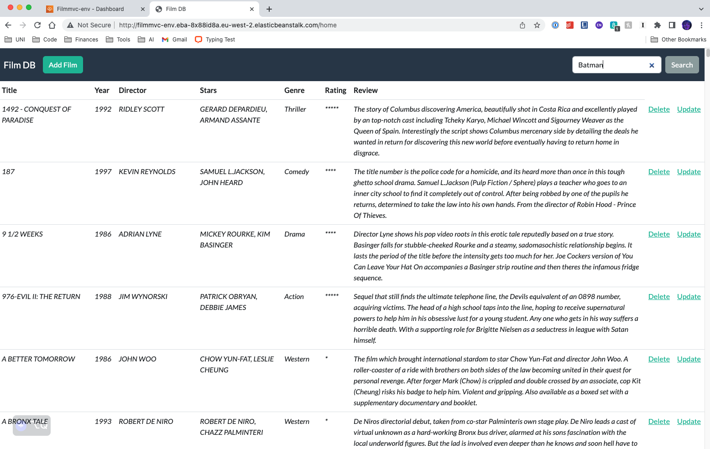
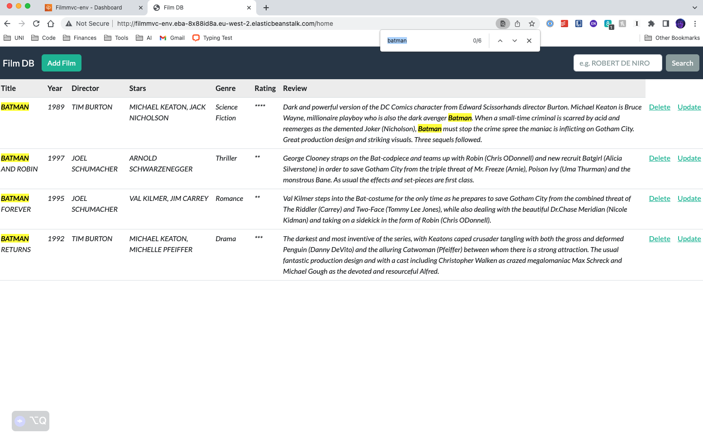
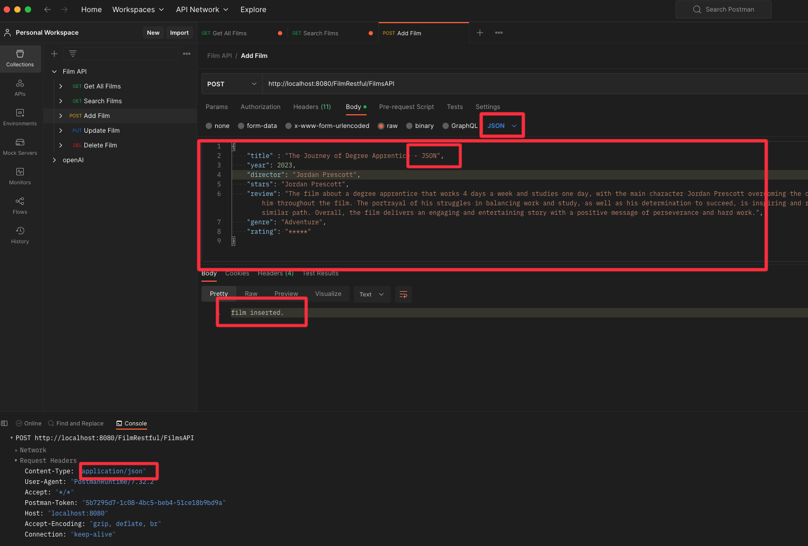
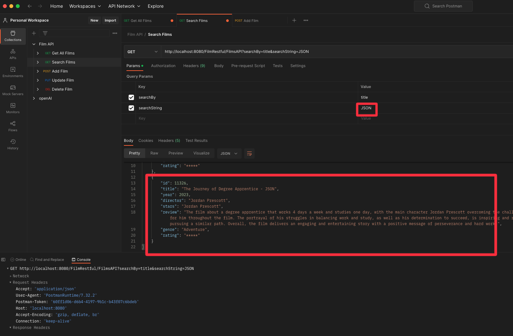

# Enterprise Programming Y3 Assignment

## Assignment Goal 
The goal of this assignment was to build two applications that would allow a user full Create, Read, Update, Delete (CRUD) functionality to a film database. One application must follow the Model View Controller design pattern and the other must follow a client-server pattern. A Restful API must be developed to allow the client to make API requests allowing CRUD functionality. Each is a web application and one must be hosted on on the cloud and evidence. 

Each application achieves the goal, below are screenshots displaying some functionality.

## FilmMVC (Hosted in AWS)

## Restful API

## FilmRestful 

