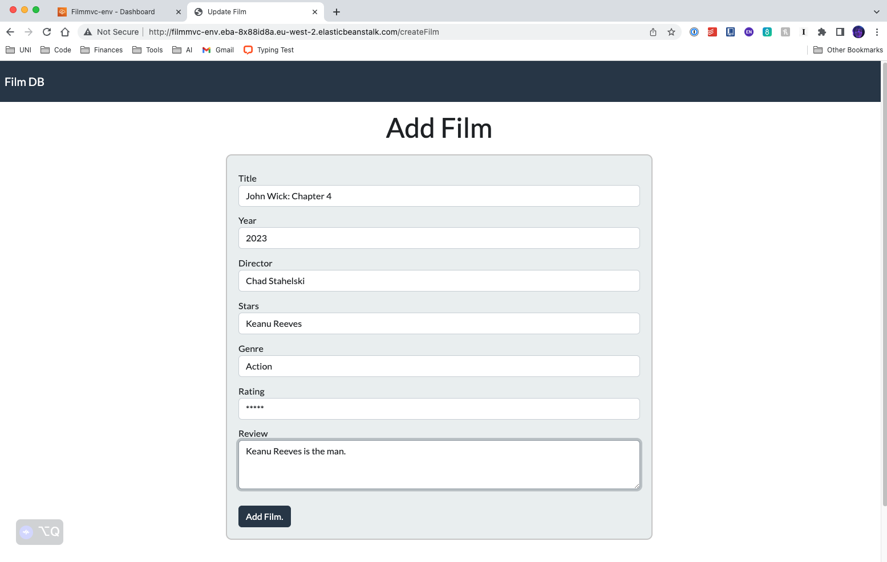
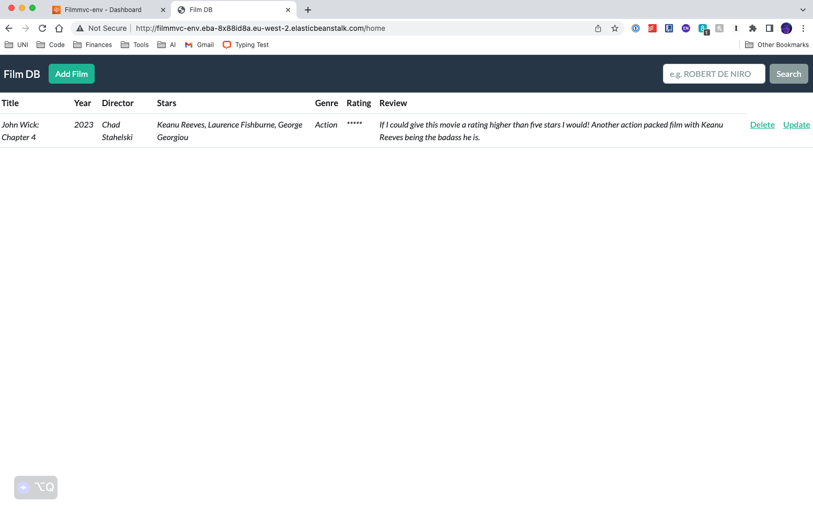
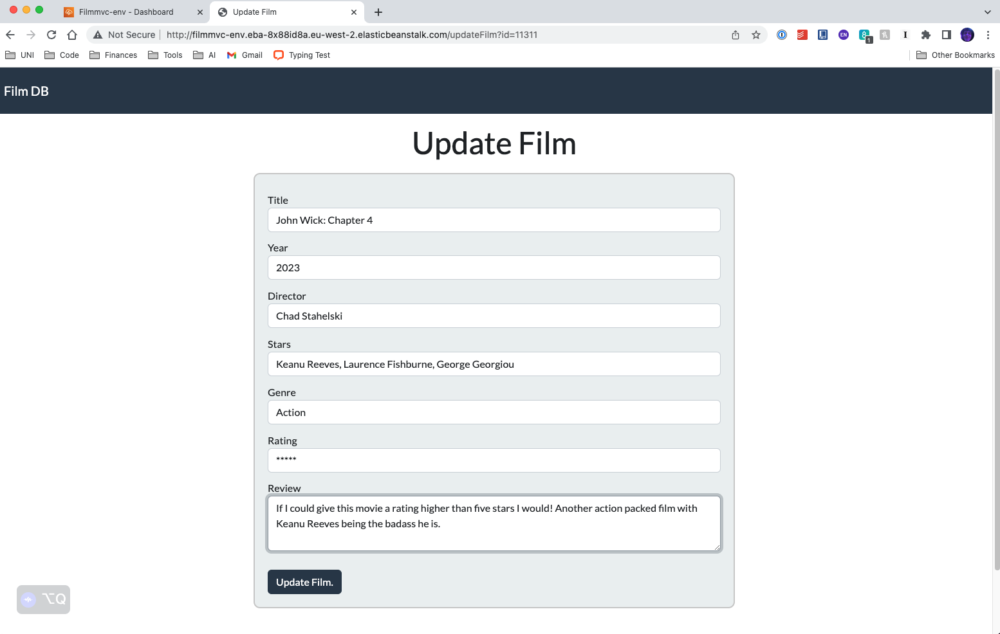
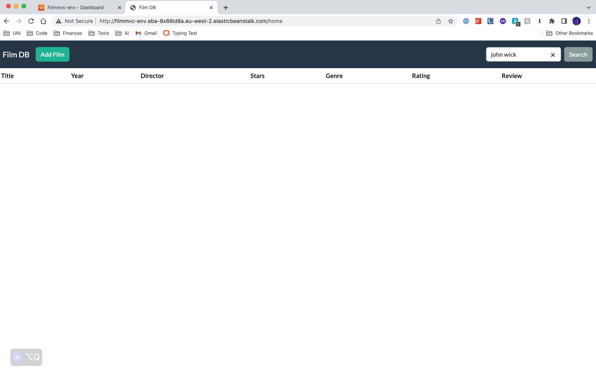
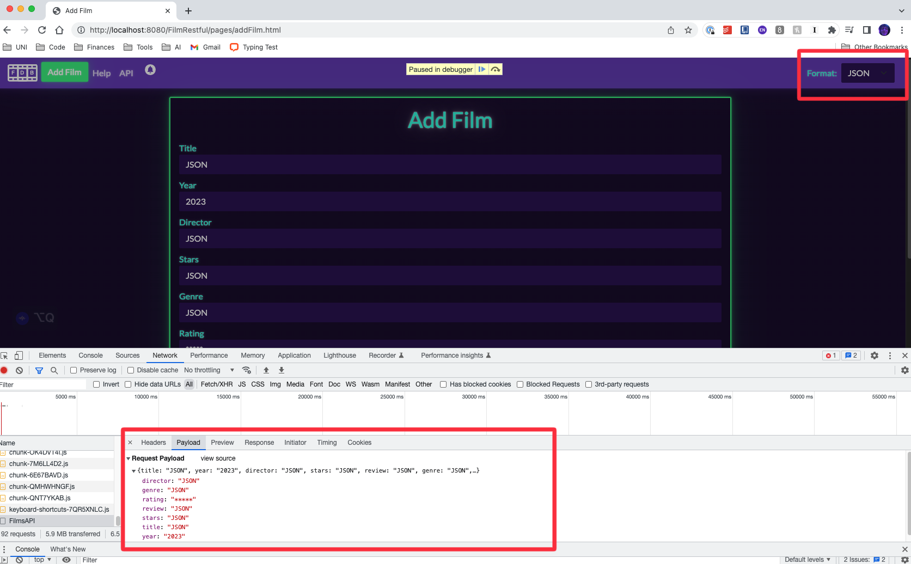
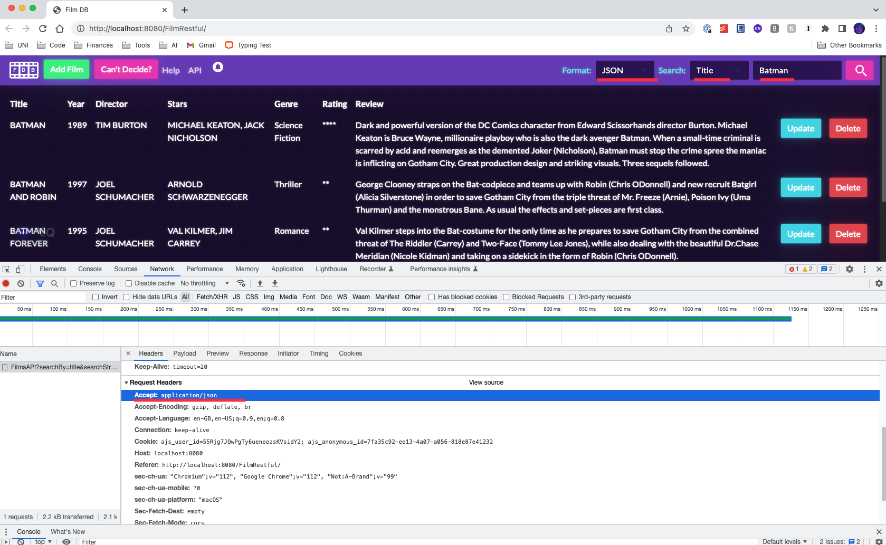
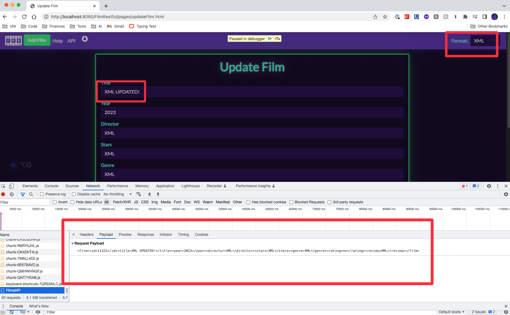
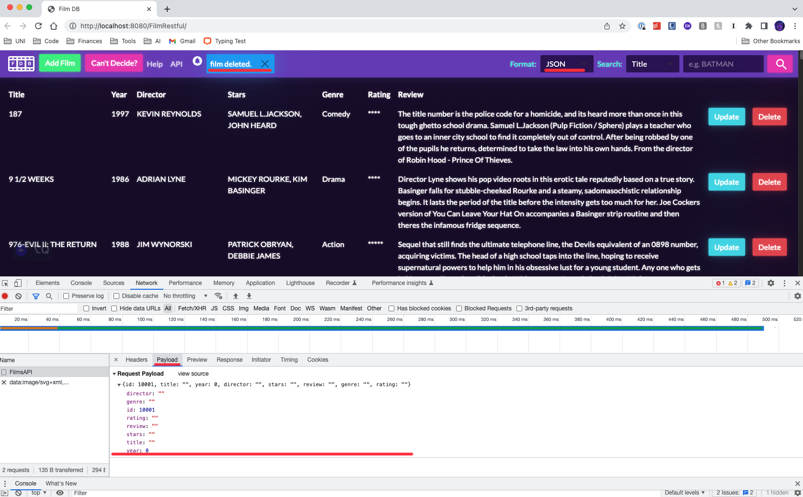
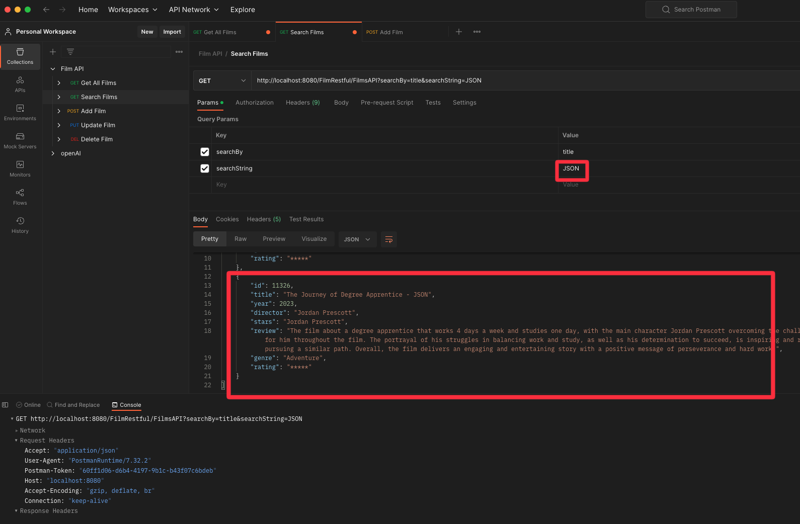

# Enterprise Programming Y3 Assignment

## Description
The assignment entails developing two applications for a film database: an MVC web application and a RESTful web service with a JavaScript client. The MVC web application allows users to perform CRUD operations on the film database through a user-friendly interface. Its built using Java servlets, JSP views, and modern frontend web frameworks, with a focus on code quality, modularity, and maintainability. The final version of the application was eployed to AWS cloud platform, utilizing a cloud-based MySQL database for persistence.

The RESTful web service provides a mechanism for users to interact with the film database through HTTP methods (GET, POST, PUT, DELETE).
It supports multiple data formats (JSON, XML, TEXT) and allows clients to choose the format for data exchange. The JavaScript client consumes the web service, offering functionalities for browsing, searching, inserting, updating, and deleting films. 

## FilmMVC (Hosted in AWS)
The first application involves building an MVC web application using Java servlets and JSP views. This application provides a user interface that allows users to perform CRUD operations on a film database. Users can browse and search the database by title, year, director, stars, genre, and rating. The code adheres to good software engineering practices, including a modular and easily maintainable design. In addition, the final version of the application was deployed to AWS cloud platform. 

### CREATE

### READ

### UPDATE 

### DELETE

## FilmRestful
The second application involves implementing a RESTful web service with a JavaScript client. The web service shoulds REST principles and provide CRUD functionality for the film database. Users are able to retrieve, insert, update, and delete film records using appropriate HTTP methods. The web service supports multiple data formats, such as JSON, XML, and TEXT, and allow clients to choose the format for data exchange. The JavaScript client consumes the web service and presents the film data to the user in a cohesive manner. The client includes features for browsing and searching the database and provide options for inserting, updating, and deleting films. 

### CREATE

### READ

### UPDATE 

### DELETE

### Postman Call Example Adding Film

